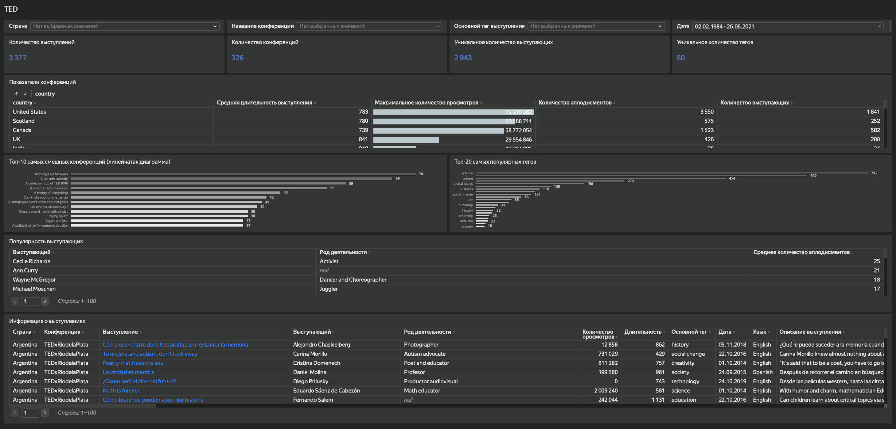

# Анализ конференций TED

## О проекте

Компания, получившая лицензию на проведение TED-конференций, готовит своё первое мероприятие. Для планирования программы необходимо изучить опыт прошедших конференций: популярные темы, характеристики выступлений и реакцию аудитории.

Цель проекта — разработать интерактивный дашборд, который поможет организаторам исследовать историю TED-конференций и использовать полученные данные при выборе тем, спикеров и формата мероприятия.

## Задачи

В рамках проекта необходимо:

- оценить объём доступных данных о конференциях, выступлениях, спикерах и темах;
- исследовать основные показатели конференций в разрезе стран;
- определить популярные темы выступлений;
- изучить реакцию аудитории на выступления;
- проанализировать наиболее популярные выступления и спикеров;
- предоставить возможность детального просмотра отдельных выступлений.

## Дашборд

**[Открыть интерактивный дашборд в Yandex DataLens](https://datalens.yandex/s4owcoa3ymlmd)**

## Возможности дашборда

Дашборд позволяет:

- фильтровать данные по стране, конференции, основному тегу и периоду;
- отслеживать количество конференций, выступлений, уникальных спикеров и тегов;
- сравнивать конференции по длительности выступлений, просмотрам, аплодисментам и количеству спикеров;
- изучать наиболее популярные темы;
- анализировать выступления с наибольшей реакцией аудитории;
- сравнивать популярность спикеров и их род деятельности;
- переходить от агрегированных показателей к подробной информации об отдельных выступлениях.

## Данные

Для построения дашборда использовались данные о TED-конференциях, представленные в трёх связанных таблицах:

- `events` — информация о конференциях;
- `speakers` — информация о выступающих;
- `talks` — информация о выступлениях.

## Инструменты

**Yandex DataLens**

Использованы связанные чарты, таблицы, индикаторы, селекторы, иерархия и детализация данных.

## Результат

Разработан интерактивный дашборд для исследования истории TED-конференций. Он позволяет анализировать данные от общего уровня до отдельных выступлений и сравнивать конференции, темы и спикеров по ключевым показателям.
